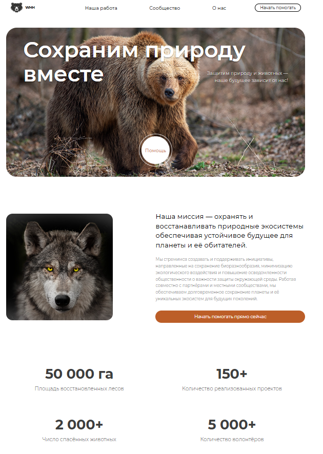
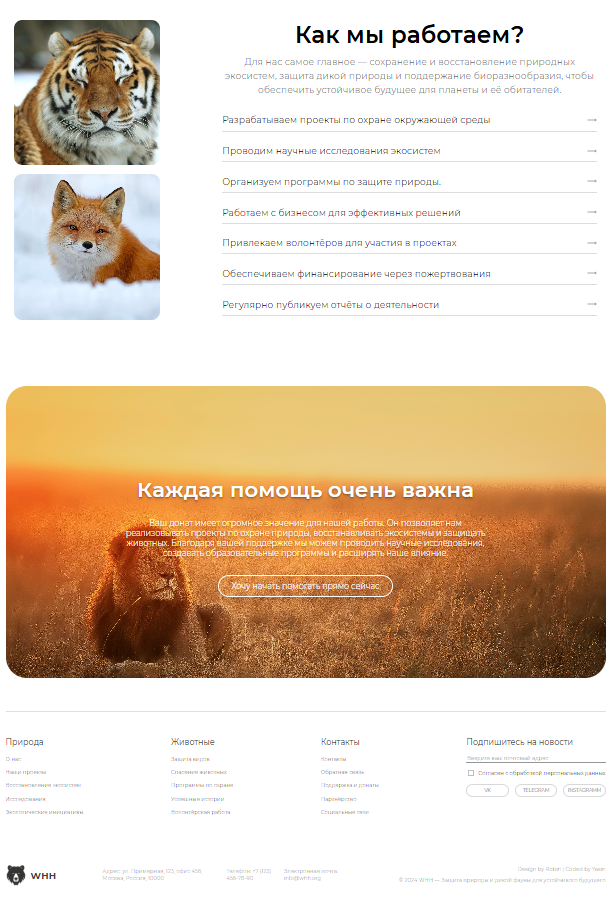

### WHH — Wild Habitat Help
Этот проект — учебная реализация дизайн-макета сайта **Wild Habitat Help** с использованием **HTML** и **CSS**. Он создан в рамках практики и предназначен для отработки навыков верстки и понимания структуры веб-страниц.

## 📚 О проекте

Проект представляет собой адаптацию готового дизайна в виде полноценной веб-страницы. Основной упор сделан на корректную реализацию верстки, соблюдение визуальной иерархии и точное соответствие макету.

## 💡 Цель

Цель проекта — закрепить навыки верстки, научиться точно переносить макет из figma в код и глубже разобраться в работе с HTML и CSS.

## 🛠 Выполненная работа

- Размечена структура страницы с помощью HTML5
- Создана адаптивная и семантически правильная верстка
- Использованы современные возможности CSS для стилизации элементов
- Обеспечено визуальное соответствие оригинальному дизайну

## Технологии

- **HTML5** — семантическая разметка страницы
- **CSS3** — стилизация, Flexbox, Grid, кастомные шрифты
- **Шрифты** — Montserrat (локальное подключение через @font-face)
  
## 🗂 Структура

- index.html — главная HTML-страница
- style.css — файл со стилями
- Папки с изображениями и дополнительными ресурсами

## 🚀 Запуск проекта

1. Откройте файл `src/index.html` в любом современном браузере
2. Убедитесь, что все файлы шрифтов и изображений находятся на своих местах

P.S: Для более удобного просмотра сайта предоставлена ссылка на GitHub Pages:

🔗 [GitHub Pages](https://t1nder.github.io/WHH-project/)

## 📌 Примечание
Проект не содержит функциональной части (JavaScript, серверной логики) и является исключительно учебным. Он не предполагает использования в продакшене, а предназначен для демонстрации навыков верстки.

